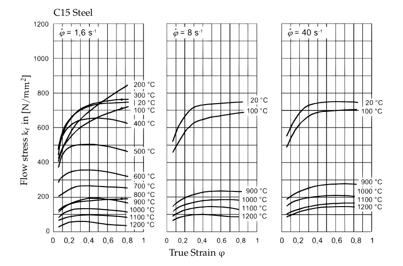

# Master Thesis (Data Science Project)

This project contains procedures regarding my master thesis: **"Design and implementation of a machine learning model for the prediction of production times, as an optimization tool for proposal management tasks for die forged products."**. This has been my most comprenhensive Data Science Project until now. Due to a nondisclosure agreement, I am not able to share any data or code regarding the project. For this reason I am only going to provide information about the procedure used in the project.

---
## Introduction 

Already in the development phase of new high-quality components, engineers are faced with the question of the relationship between function and manufacturing costs. Often, the intended use case and the resulting geometric design of a component determine which manufacturing process might make sense from a production and commercial point of view. The decision-making processes can take a long time, which unnecessarily prolongs the development time of products. One of the main aims in the product development department is to provide customers' development engineers with the most accurate possible cost, requirement, and quality-related advantages of the closed-die forging process to help facilitate quick decision-making. 
A high degree of technical and experiential knowledge is required to meet this standard, which is already applied during the pre-calculation phase through the development of technically sophisticated workflow sequences. It quickly becomes clear what an immense effort hides behind the processing of a customer product request. Information from the most diverse production areas must be collected repeatedly and evaluated and classified concerning its relevance for the best possible manufacturing process. 

This work tries to tackle, employing `Supervised Machine Learning`, the proposal management process in product development. It should be possible to noticeably accelerate the processing time of the pre-calculation process with machine learning methods and at the same time maintain a high quality of the proposal management results. This use case aims to reduce the dependency on Empirical Research for assignment of production times, particularly for the forging process of closed die forged parts, eliminating the need for FEM Simulations to back up first-time proposals.

`Closed die forging` belongs according to the German Institute for Standardisation DIN to the pressing forming processes besides indentation, rolling and open die forging. For the forging process, forging dies with the negative geometries are used. A preheated ingot is put between the dies, force is applied (e.g. forging hammer), the material starts to flow inside the die until the end geometry is filled. 

Hydraulic Counterblow Hammer          |  Closed die forging process
:-------------------------:|:-------------------------:
  |  
****

Due to the way materials and especially steel aloys behave in the plasticity section (This is the section in which material deforms and cannot return to its initial state)

