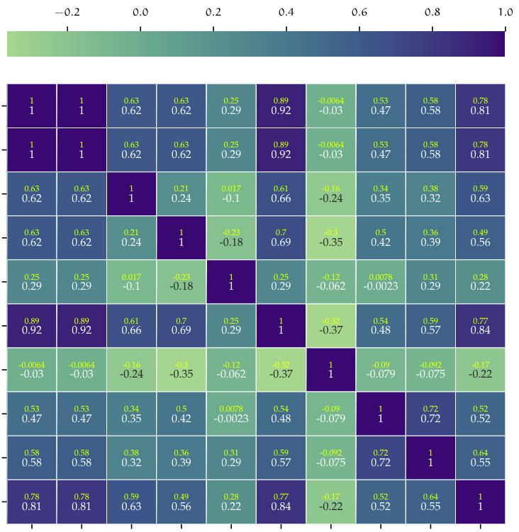
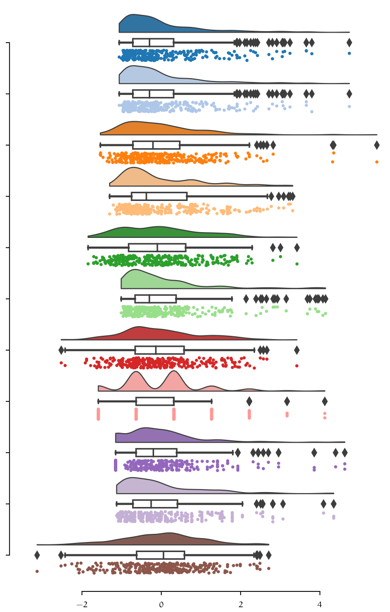
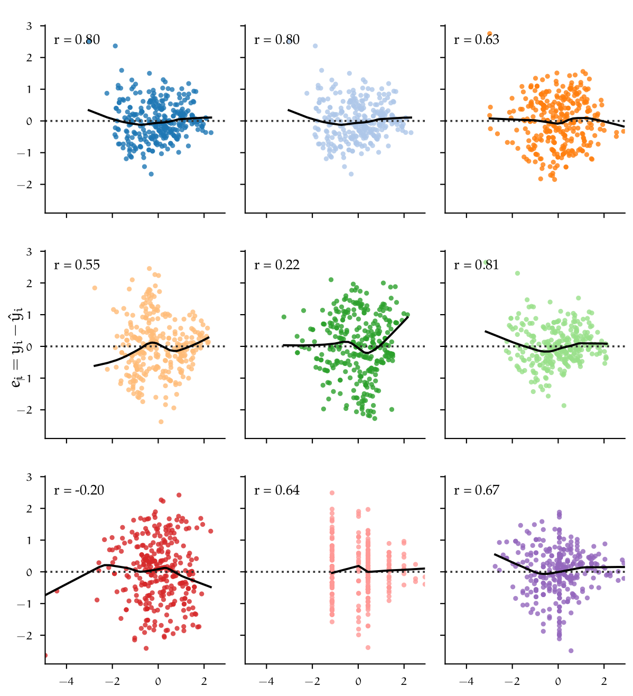

# Master Thesis (Data Science Project)

This project contains procedures regarding my master thesis: **"Design and implementation of a machine learning model for the prediction of production times, as an optimization tool for proposal management tasks for die forged products."**. This has been my most comprenhensive Data Science Project until now. Due to a nondisclosure agreement, I am not able to share any data or code regarding the project. For this reason I am only going to provide information about the procedure used in the project.

---
## Introduction 

Already in the development phase of new high-quality components, engineers are faced with the question of the relationship between function and manufacturing costs. Often, the intended use case and the resulting geometric design of a component determine which manufacturing process might make sense from a production and commercial point of view. The decision-making processes can take a long time, which unnecessarily prolongs the development time of products. One of the main aims in the product development department is to provide customers' development engineers with the most accurate possible cost, requirement, and quality-related advantages of the closed-die forging process to help facilitate quick decision-making. 
A high degree of technical and experiential knowledge is required to meet this standard, which is already applied during the pre-calculation phase through the development of technically sophisticated workflow sequences. It quickly becomes clear what an immense effort hides behind the processing of a customer product request. Information from the most diverse production areas must be collected repeatedly and evaluated and classified concerning its relevance for the best possible manufacturing process. 

This work tries to tackle, employing `Supervised Machine Learning`, the proposal management process in product development. It should be possible to noticeably accelerate the processing time of the pre-calculation process with machine learning methods and at the same time maintain a high quality of the proposal management results. This use case aims to reduce the dependency on Empirical Research for assignment of production times, particularly for the forging process of closed die forged parts, eliminating the need for FEM Simulations to back up first-time proposals.

`Closed die forging` belongs according to the German Institute for Standardisation DIN to the pressing forming processes besides indentation, rolling and open die forging. For the forging process, forging dies with the negative geometries are used. A preheated ingot is put between the dies, force is applied (e.g. forging hammer), the material starts to flow inside the die until the end geometry is filled. 

<table>
<thead>
<tr>
    <th>Hydraulic Counterblow Hammer</th>
    <th>Closed die forging process</th>
</tr>
</thead>
<tbody>
<tr>
    <td></td>
    <td></td>
</tr>
</tbody>
</table>

Due to the way materials and especially steel aloys behave in the plasticity state (this is the state in which material deforms and can not return to its initial state) it is not possible using a generalized formula to calculate the required time for the forging process. The plastic deformation behavior from materials cannot be linearly explained. Depending on temperature, chemical composition of the material at varying strain rates, the amount of force needed to achieve the desired true strain varies. Below is a Comparison of flow curves for a C15 steel, with different temperatures and strain
rates.  



Until now, the prediction of the materials' behaviour on the parts' geometry can only be achieved using FEM (Finite element method) simulations. The idea of this project is to find a faster way of achieving a prediction of the forging time for which the deformation force plays an important role. 

## Data availability

Data availability has become nowadays a topic of high relevance for most companies. Technologies like Data Mining are used to find interesting patterns in data that might well already been there, stored and archived or being generated on a daily basis. The learning dataset is composed of data coming from different sources. All parameters were collected for 313 different products, for which all 19 features were available. The resulting dataset is a mixture of continous and categorical variables. This dataset was used as the master dataset. Later on records from the feedback system were joined with the master dataset. 



## Exploratory Data Analysis (EDA)

Data analysis is a crucial step in any Machine Learning problem, is a way to introduce and understand data before moving further to the modeling process. Data analysis provides the analyst with important information about data types, relation between variables in a dataset, their shape, form, distribution as well as descriptive statistics. In data analysis patterns in the data can be discovered by means of numerical tests and visualization techniques. This is in fact one of the most time-consuming steps on any project, since it requires data to be consolidated and prepared for the analysis.

<table>
<thead>
  <tr>
    <th>Correlation Matrix</th>
    <th>Data distribution</th>
  </tr>
</thead>
<tbody>
  <tr>
    <td></td>
    <td rowspan="3"></td>
  </tr>
  <tr>
    <th>Analysis of residuals</th>
  </tr>
  <tr>
    <td></td>
  </tr>
</tbody>
</table>

## Model evaluation
There are numerous regression algorithms already implemented in libraries like `scikit-learn` that one can choose from. I chose a simple linear regression models as my baseline model, since it is fast to train due to its vectorized closed form implementation, and easy to interpret. At this point in time categorical variables were removed from the dataset, leaving only continous numerical variables. This was first investigated to see, if only by using numerical variables a good model could be created. The Inclusion of categorical variables requires further preprocessing (encoding) of those variables to a continous space. After getting first results and model accuracy, a set of different models were tested on the same dataset to create a benchmark. 

| Model                           | MAE     | MSE      | RMSE    | R2      | RMSLE  | MAPE   | TT (Sec) |
|---------------------------------|---------|----------|---------|---------|--------|--------|----------|
| CatBoost Regressor              | 4.2354  | 50.8014  | 6.9793  | 0.8645  | 0.2672 | 0.2042 | 1.618    |
| Extra Trees Regressor           | 4.3761  | 56.3788  | 7.2692  | 0.8534  | 0.2778 | 0.2097 | 0.029    |
| Random Forest Regressor         | 4.4652  | 58.7568  | 7.4328  | 0.8481  | 0.2661 | 0.2050 | 0.038    |
| Gradient Boosting Regressor     | 4.5829  | 60.1312  | 7.5515  | 0.8387  | 0.2703 | 0.2183 | 0.014    |
| Light Gradient Boosting Machine | 4.5967  | 66.1371  | 7.8272  | 0.8363  | 0.2817 | 0.2099 | 0.008    |
| Extreme Gradient Boosting       | 4.5624  | 67.4343  | 7.9526  | 0.8192  | 0.2789 | 0.2110 | 12.492   |
| AdaBoost Regressor              | 6.6773  | 81.7521  | 8.9387  | 0.7735  | 0.3999 | 0.4283 | 0.012    |
| Decision Tree Regressor         | 5.2150  | 87.8739  | 9.1760  | 0.7619  | 0.3138 | 0.2339 | 0.004    |
| K Neighbors Regressor           | 5.3629  | 88.5753  | 9.2931  | 0.7544  | 0.3071 | 0.2343 | 0.005    |
| Ridge Regression                | 6.6509  | 95.4289  | 9.5335  | 0.7442  | 0.3869 | 0.3239 | 0.004    |
| Least Angle Regression          | 6.6597  | 95.6338  | 9.5440  | 0.7433  | 0.3877 | 0.3246 | 0.005    |
| Linear Regression               | 6.6597  | 95.6337  | 9.5440  | 0.7433  | 0.3877 | 0.3246 | 0.004    |
| Elastic Net                     | 6.9408  | 98.6090  | 9.7182  | 0.7374  | 0.3786 | 0.3313 | 0.004    |
| Lasso Regression                | 6.9496  | 98.9866  | 9.7357  | 0.7366  | 0.3792 | 0.3319 | 0.004    |
| Huber Regressor                 | 6.5085  | 100.9395 | 9.7533  | 0.7321  | 0.3367 | 0.3023 | 0.006    |
| Bayesian Ridge                  | 7.0413  | 100.8291 | 9.8349  | 0.7312  | 0.3786 | 0.3334 | 0.004    |
| Orthogonal Matching Pursuit     | 8.0436  | 146.5258 | 11.7492 | 0.6310  | 0.3851 | 0.3827 | 0.004    |
| Passive Aggressive Regressor    | 9.8682  | 207.8557 | 13.9189 | 0.4282  | 0.5120 | 0.3922 | 0.004    |
| Lasso Least Angle Regression    | 15.6397 | 406.6446 | 19.7724 | -0.0291 | 0.7431 | 1.0209 | 0.004    |

As we can see, benchmarking different models with their standard configurations gives us a pretty good start in terms of accuracy. Accuracy was measured using the **RMSE** (Root Mean Squared Error) metric. These models have still the potential to be optimized. Model optimization goes beyond numerical optimization e.g. **Grid Search** or **Random Search**. Performance of a model can also be improved by carefully performing **feature engineering** and **ensenmbling or stacking** models together. In the table above is possible to see, that relatively simple algorithms like **Random Forest** perform better than more complex and modern approaches like **LGBM (Light Gradient Boosting Machine)**. In fact, the difference in performance between the Random forest Regressor and the CatBoost Regressor is marginal in terms of the RMSE (measured in minutes) one small difference is the training time required for CatBoost is significantly higher, which for the final size of the dataset does not make a lot of difference but if scaled could potentially present an issue.

### Hyperparameter Optimization

Since Random Forest is supported natively by **scikit-learn** we can make use of the **GridSearchCV** and **RandomSearhCV** classes to perform Hyperparameter Optimization. The following table show the optimization proocess for the Random Forest Regressor estimator.

| Hyperparameter                                   | Value range                                                                             | GSearch        | RSearch        |
|--------------------------------------------------|-----------------------------------------------------------------------------------------|----------------|----------------|
| Max. depth                                       | $$ \{None, [2,10] \in \mathbb{Z}\} $$                                                   | 8              | None           |
| Max. features                                    | $$ \{auto, sqrt, log2\} $$                                                              | sqrt           | log2           |
| Max. leaf nodes                                  | $$ \{None, [2,10] \in \mathbb{Z}\} $$                                                   | None           | None           |
| Criterion                                        | $$ \{mse, friedeman mse, mae, poisson\} $$                                              | friedman mse   | mae            |
| ccp alpha                                        | $$ [0, 0.9] \in \mathbb{R} $$                                                           | 0.1          | 0           |

First a **hyperparameter space** was defined. This set of parameter combinations are used by either constructing the cartesian product of all combinations in case of Grid Search. Which is a Brute force approach to optimization where all possible combinations are evaluated. Or using **Random Search**, which randomly (in this case) samples from the hyperparameter space. The results with a 10-fold cross validation are summarized below.

|**Metric**                 | **Resources**                                                                              | GSearch        | RSearch        |
|---------------------------|--------------------------------------------------------------------------------------------|----------------|----------------|
|$$ R^{2} $$ with $$ CV = 10 $$       | Performed on a machine  with 12 CPU cores at 4.3 Ghz and  16 Gb of RAM           | 0.8737         | 0.8723         |
|$$ RMSE $$ with $$ CV = 10 $$        |                                                                                  | **6.510**      | **6.541**      |
|Number of fits with $$ CV = 10 $$ |                                                                                     | 48600          | 2500           |
|Compute time (seconds)  |                                                                                               | 768            | 40.3           |

Taking a look at the results after cross validation is possible to see that, the optimization using either Grid Search or Random Search improved the performance of the model by almost over a minute in reduction in the RMSE (See baseline/unoptimized model in table below). Grid Search uses more ressources since it has to fit a larger number of combinations. Random search from the other side requires a fraction of the number of repetitions needed by Grid Search, thus achieving a similar result. At this point there is not much that one could do to the model in terms of hyperparameter optimization. The next step was to see if modifying the feature space could result in an increase of performance. 

|**Baseline model**         | $$ \mathbf{RMSE} $$                                                                        | $$ \mathbf{R^2} $$ | $$ \mathbf{MAE} $$ |
|---------------------------|--------------------------------------------------------------------------------------------|----------------|----------------|
| Random Forest regressor                          |  7.4328                                                                                 | 0.8481        |  4.4652      |

### Dimensionality reduction

For the dataset multiple dimensionality reduction `(PCA, LASSO)` and feature selection techniques `(Model based feature selection, Recursive feature elimination)`, were used on the dataset in order to achieve lower dimensionality as well as better performance. At this point the complete dataset was used, by converting categorical variables to numeric, using **OneHot encoding**. The dimension of the dataset changed from 19 to 70 variables. 

### Model based feature selection
Starting with **Model based feature selection** a supervised algorithm, in this case a random forest regressor was used to learn the feature importance of the model. This method uses a supervised algorithm e.g. a decision tree or random forest as well as linear models, to learn the feature importance of the data in the model before fitting the final estimator. Performing model-based feature selection on the encoded dataset results in a reduction from 70 features to 35. The criteria implemented in scikit-learn library for choosing which variables to keep is based on the Mean decrease in impurity (MDI) metric, which can use any defined impurity measure $$ t(i) $$ , e.g. mean squared error for regression or Gini coefficient for classification.

### Recursive Feature Elimination (RFE)

Another approach for selecting features is by recursively fitting a model with a smaller subset of features on each iteration. This method uses an estimator e.g. Random Forest regressor and ranks features on each iteration based on some importance metric, for example, the mean decrease impurity used for model-based selection. On each iteration, the least important features are removed until a predefined threshold is achieved.



The figure above shows the implementation of Recursive Feature Elimination with Cross Validation (RFECV). The learning curve indicates how the number of predictors in- creases or decreases the performance of the used estimator by inducing variance (adding more predictors), which leads to a decrease in bias. The dotted vertical line marks the point on the graph at which the highest cross-validated train score was achieved, given a certain number of features. In this case, keeping 47 out of 70 variables lead to the most accurate model. One major drawback from using recursive feature elimination and also model-based feature selection is the fact that only a subset of some categorical variables was chosen to be relevant. This is due to the way variables are encoded. Dummy variables are treated as single features and therefore the algorithm does not have information whereas a feature is to be considered as part of a category or just an independent variable. Using only some dummy features in a future model would change the whole dataset definition.

### GROUP LASSO

To overcome the problem of feature selection with dummy variables, there is a method that addresses this issue, by taking into account grouped features. Group lasso (Group least absolute shrinkage and selection operator)

<!-- https://hw311.me/en/jekyll/2019/01/23/support-latex-in-jekyll-blog/ -->

$$ 
\begin{align}
        \sum_{i = 1}^{n} \left(y_{i} - \beta_{0} - \sum_{j = 1}^{p} \beta_{j}x_{ij}  \right)^{2} + \lambda \sum_{j = 1}^{p} \beta_{j}^{2} &\Longleftrightarrow  RSS + \lambda \sum_{j = 1}^{p} \beta_{j}^{2} & \text{(Ridge)}
        \\
        \sum_{i = 1}^{n} \left(y_{i} - \beta_{0} - \sum_{j = 1}^{p} \beta_{j}x_{ij}  \right)^{2} + \lambda \sum_{j = 1}^{p} \left\lvert \beta_{j} \right\rvert &\Longleftrightarrow   RSS + \lambda \sum_{j = 1}^{p} \left\lvert \beta_{j} \right\rvert & \text{(Lasso)}
\end{align}
$$

three norms $$\ell_{0}$$, $$\ell_{1}$$, $$\ell_{2}$$ can be considered:

$$
\begin{equation}
    \ell_{0} := \left\lVert \beta\right\rVert_{0} = \sum_{j = 1}^{p} 1\left\{\beta_{j} \neq 0 \right\}, \quad  \ell_{1} := \left\lVert \beta\right\rVert_{1} = \sum_{j = 1}^{p} \left\lvert \beta_{j}\right\rvert, \quad \ell_{2} := \left\lVert \beta\right\rVert_{2} = \left(\sum_{j = 1}^{p} \beta^{2}\right)^{1 / 2}   
\end{equation}
$$
  
the optimization problem becomes:

$$   
 \begin{align}
    \underset{\beta \in \mathbb{R}^{p}}{\text{argmin}} ~ RSS + \lambda \sum_{j = 1}^{p} \beta_{j}^{2} & \Longleftrightarrow  \underset{\beta \in \mathbb{R}^{p}}{\text{argmin}} ~ \left\lVert \mathbf{y} - \mathbf{X}\beta \right\rVert_{2}^{2} + \lambda \left\lVert \beta\right\rVert_{2}^{2} & \text{(Ridge)}
    \\
    \underset{\beta \in \mathbb{R}^{p}}{\text{argmin}} ~ RSS + \lambda \sum_{j = 1}^{p} \left\lvert \beta_{j} \right\rvert & \Longleftrightarrow  \underset{\beta \in \mathbb{R}^{p}}{\text{argmin}} ~ \left\lVert \mathbf{y} - \mathbf{X}\beta \right\rVert_{2}^{2} + \lambda \left\lVert \beta\right\rVert_{1} & \text{(Lasso)}
 \end{align}
$$

The penalization $\left\lVert \beta\right\rVert_{2}$ used for Ridge is formalized as the $\ell_{2}$ norm  --- usually known as the **Euclidean norm** --- and $\left\lVert \beta\right\rVert_{1}$ as the $\ell_{1}$ norm --- known as the **Manhattan norm** --- for lasso. If $\lambda = 0$, then both models solve OLS (Ordinary least squares). $\ell_{1}$ and $\ell_{2}$ constrain the size of the coefficients, e.g. the increase of a coefficient is only possible if it leads to a decrease in the RSS and $\lambda > 0$. In turn, ncreasing $\lambda$ would force some coefficient towards zero. If one would like to reduce the feature space, using the $\ell_{2}$ norm is not a viable solution, since the coefficients would never be able to be exactly zero. By definition, Ridge regression is non-sparse and will contain all zero coefficient for the solution.  The lasso model using the $\ell_{1}$ norm allows for sparsity and as $\lambda$ increases, sparsity increases as well. This regularization approach allows coefficients to be exactly zero and therefore remove those variables from the model, where $\left(x_{i}\beta_{i}\right), ~ \beta_{i} = 0$. Applying lasso to the dataset would result in a sparse model, but the issue of grouped variables remains. Group lasso, which aims exactly at solving that issue solves the following optimization problem.

$$
\begin{equation}
    \underset{\beta \in \mathbb{R}^{p}}{\text{argmin}} \left\lVert y - \sum_{l = 1}^{L} X_{l}\beta_{l}\right\rVert_{2}^{2} + \lambda \sum_{l = 1}^{L} \sqrt{p_{l}} \left\lVert \beta_{l}\right\rVert_{2}\label{eqn:group_lasso}       
\end{equation}
$$

all predictor variables are divided into $l = l_1, l_2 \dots L$ different groups. $X_{l}$ is the submatrix of $X$ corresponding to the variables $l$. $\beta_{l}$ is the coefficient vector for the group $l$ and $\sqrt{p_{l}}$ is the square root of the size of elements in group $l$. Notice that the $\left\lVert \beta_l \right\rVert_{2}$ norm is not squared as for ridge. If the size of $L = 1$ then Group lasso reduces to lasso. Group lasso will perform feature selection at the group level, so that it is able to eliminate complete groups of features. The parameter $\lambda$ controls the amount of regularization. The group size penalty parameter $\sqrt{p_{l}}$ allows for each group to be penalized differently. The group lasso can be further extended to perform selection at both the group and within group level. This variant is called the **sparse group lasso**.

$$
\begin{equation}
    \underset{\beta \in \mathbb{R}^{p}}{\text{argmin}} \left\lVert y - \sum_{l = 1}^{L} X_{l}\beta_{l}\right\rVert_{2}^{2} + \lambda_{1} \sum_{l = 1}^{L} \left\lVert \beta_{l}\right\rVert_{2} + \lambda_{2} \left\lVert \beta\right\rVert_{1}\label{eqn:sparse_group_lasso}
\end{equation}
$$

The sparse group lasso is not really usable to solve for the problem with the dummy variables stated above, since additional selection within groups is performed. The reason for reference is that some implementations in Python, reuse the sparse model definition to perform either group lasso or lasso. Richie-Halford introducees [**Groupyr**](https://richiehalford.org/groupyr/), a Python package for sparse group lasso which also supports cross validation for hyperparameter optimization using either grid search or bayesian optimization. The implementation of sparse group lasso can be extended with the parameter $\alpha \in \left[0,1\right]$ --- $\alpha = 0$ gives the group lasso fit, $\alpha = 1$ gives the lasso fit --- according to:

$$
\begin{equation}
    \underset{\beta \in \mathbb{R}^{p}}{\text{argin}} \left\lVert y - \sum_{l = 1}^{L} X_{l}\beta_{l}\right\rVert_{2}^{2} + \left(1-\alpha\right)  \lambda_{1} \sum_{l = 1}^{L} \left\lVert \beta_{l}\right\rVert_{2} + \alpha\lambda_{2} \left\lVert \beta\right\rVert_{1}
\end{equation}
$$

The second implementation of group lasso was used for the analysis. This package implemetns the group lasso algorithm in the [**Celer**](https://mathurinm.github.io/celer/#) Python package. This also supports cross-validated hyperparameter optimization for finding the optimal values of $\alpha$ and $\lambda$.

### Principal Component Analysis (PCA)

Instead of removing features from the feature space to reduce dimensionality on a dataset, one can search —geometrically speaking— for directions in a dataset on which the most variance lives in. By taking variables that are highly correlated with each other, linear combinations can be constructed, so that data can be represented in a lower- dimensional space. Principal Component Analysis (PCA) builds upon the fundamentals of matrix factorization, especially the Singular Value Decomposition (SVD). The SVD is a cornerstone of a lot of methods in engineering and mathematics since it provides a simple generic way of decomposing any matrix X into the matrices:

$$
\begin{equation}\label{eqn:svd}
    X  = U ~ \varSigma  ~ V^{T}
\end{equation}
$$

Both $U$ and $V^{T}$ are unitary matrices --- that means, their product with the transpose results in the identity matrix $I$ --- and $\varSigma$ is a diagonal non-zero matrix and full rank. The diagonal entries in $\varSigma$ are called **singular values** and are ranked in importance so that $\sigma_{1} > \sigma_{2} > \dots \sigma_{r}$. The SVD factorization provides a way of accurately approximating a matrix using multiple low-rank matrices. One could expand the right side of the equation \ref{eqn:svd} to see the linear combinations of rank-1 matrices:

$$
\begin{equation}
    \tilde{X} = \sum_{k = 1}^{r} \sigma_{k}u_{k}v_{k}^{T}  = \sigma_{1}u_{1}v_{1}^{T} + ... +  \sigma_{r}u_{r}v_{r}^{T}
\end{equation}
$$

Each outer product of $u_{k}v_{k}^{T}$ is scaled by the singular value $\sigma_{k}$. Since $\sigma_{k}$ is ordered in descending order the first matrix is scaled by the largest singular value. It is important to note that since the matrix $\varSigma$ has to be rectangular, but the diagonal is square, the zero entries at the bottom would result in zero matrices. To find the best low-rank approximation to the matrix $X$ there is the \textit{Eckart-Young} theorem. The method following this theorem is called **truncated SVD**. But how does one reduce the dimensionality of the dataset when the approximation by the SVD always outputs a matrix that is the same size but with approximated values? Here is where PCA comes into play. PCA exploits the properties of the SVD for calculating the **principal components**. The PCA method assumes that data is centered around the origin. To do so the mean of the matrix $X$ is subtracted, $B$ is the new centered matrix:

$$
\begin{equation}
    B = X - \bar{X}
\end{equation}
$$

The original PCA formulation uses a factorization method called **eigenvalue decomposition** to find those principal components from the covariance matrix $C$: 

$$
\begin{equation}\label{eqn:covariance_matrix}
   C = Cov(B) = \frac{1}{n-1} B^{T}B 
\end{equation}
$$

The eigenvalue decomposition factorizes a matrix in terms of its **eigenvectors** and **eigenvalues**. This factorization can only be applied to diagonalizable matrices e.g. Hermitian matrices. The covariance matrix in equation \ref{eqn:covariance_matrix} is Hermitian for which eigen-decomposition is valid. As previously stated in this chapter, one can use SVD to also compute the eigenvectors and eigenvalues of the covariance matrix by decomposing the covariance matrix $C$:

$$
\begin{align}
    C &= X^{T}X\\
    X &= U ~ \varSigma  ~ V^{T}\\
    X^{T}X &= (U ~ \varSigma  ~ V^{T})^{T}U ~ \varSigma  ~ V^{T}\\
        &= V ~ \varSigma^{T} ~ U^{T} ~ U ~ \varSigma  ~ V^{T}\\
    X^{T}X  &= V ~ \varSigma^{2} V^{T}
\end{align}
$$

The columns of $V$ are eigenvectors of the covariance matrix $C = X^{T}X$ and $\varSigma^{2}$ is the diagonal matrix with the singular values which correspond to the square of the non-zero eigenvalues of $C$. Having found the eigenvectors and eigenvalues, then one could find the principal components by the transformation matrix $T$, taking the product of the centered data $B$ with the eigenvectors $V$ so that

$$
\begin{align}
    B &= U ~ \varSigma  ~ V^{T}\\
    B~V &= U ~ \varSigma  ~ V^{T} ~ V = U ~ \varSigma\\
    T &= B ~ V
\end{align}
$$
 
A detailed calculation of eigenvalues and eigenvectors is outside the scope of this work, more importantly is the usability these have on dimensionality reduction. The diagonal matrix $\varSigma$ of singular values (eigenvalues) $\sigma^{2}$ represents, in a statistical context, the variance. Eigenvalues and eigenvectors come in pairs and are ordered in descending order. One could see how much of the variance is explained by every eigenvector considering its eigenvalue. This is useful for dimensionality reduction, since based on the ratio of explained variance:

$$
\begin{equation}\label{eqn:ratio_expl_var}
    \frac{\sum_{k = 1}^{r} \lambda_{k} }{\sum_{k = 1}^{n} \lambda_{k}}
\end{equation}
$$

An arbitrary threshold of e.g. $95\%$ can be chosen, so that only those $r$-number of eigenvectors in $V$ are kept, which explains most of the variance in the dataset, in this case, 95\%. By applying the transformation $T$ with a reduced vector $V \in \mathbb{R}^{m \times r}$ to a high dimensional matrix, data is projected into the principal components, creating a lower-dimensional representation of the dataset. Figure below (left) exemplifies the concept of finding the principal components for a dataset. Here, the dataset is two-dimensional containing only two features. Using SVD, the dataset is decomposed so that one could plot the eigenvectors scaled by the eigenvalues. The scaled eigenvectors represent the principal components (PC) for that particular matrix, with PC1 explaining $56.77\%$ of the variance and PC2 explaining $43.23\%$.

{% include image.html url="pca.png" description="Example of applying PCA to reduce dimensionality. Left: Scatter plot between two variables. The eigenvectors scaled by their corresponding eigenvalues are visualized for that matrix, showing the directions of the highest variance expresses as a Principal components. Right: Reduction of the dimensional space from two to one dimensions by projecting data into the first principal component (due to the large amount of values only some projection lines where randomly visualized)." width="800" %}

The figure above (right), shows the result of reducing the dimensionality from two to one dimension, i.e. the dataset is projected into the first principal component PC1. The red lines between the points and the principal component describe the projection of that point into the new coordinate system, defined by the principal components. This simple example can be extrapolated to the high dimensional dataset e.g. one could reduce the $70$ features down to just the first two principal components. Having a mixed dataset containing categorical and numeric variables, is also a challenge for the use of PCA, since it assumes data to be continuous. The use of PCA would be valid by just encoding the categorical variables as did before with model selection techniques like RFE or LASSO. Nevertheless, the factorization of matrices containing categorical variables can also be approached by methods other than PCA. Factor Analysis of Mixed Data (FAMD) is a dimensionality reduction method, which is specially used to analyze mixed datasets. In essence, it combines PCA for continuous variables and Multiple Correspondence Analysis (MCA) for categorical variables. MCA is an extension of Correspondence analysis (CA), which is a method of summarizing data in a two-dimensional form of a multivariate dataset, similar to PCA. CA and MCA are out of the scope of this work, therefore the concepts will not be discussed further. FAMD, MCA and CA are implemented in Python by the [**Prince**](https://github.com/kormilitzin/Prince) package. 

